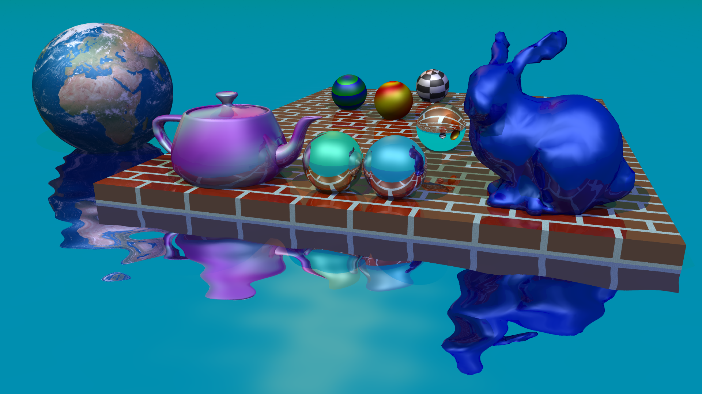

# Teapot

This project is a simple ray-trace rendering application using the Qt framework. It simply renders an image and displays it in a GUI. 

Teapot began as an Objective-C++ Cocoa application for a project in Advanced Computer Graphics (CS 548) at Washington State University. I have since ported it to Qt and C++.

## How to Build

1. Install Qt framework. (I used Qt 6.5.)
2. Open the project in Qt Creator.
3. Build the project.

## How to Use

The Teapot executable expects to find three data files in the project directory:

1. bunny_surface0.norm
2. teapot_surface0.norm
3. earth_2k.jpg

Their locations are sort of hardcoded in the source code.

1. Press the "Begin" button to start rendering.
2. The rendered image will be displayed in the `RenderView` widget.
3. Press the "Cancel" button to cancel the rendering process.
4. After rendering has finished, you can click on the image to trigger a debug rendering of a specific pixel, or:
5. Press the "Save" button to save the rendered image.

## A note about the bunny:

Stanford provides a bunny model at several different resolutions. I don't know how or why, but the bunny model is not "closed". I manually closed up the bunny model. (Naturally, I chose the bunny with the lowest triangle count). This was necessary in order to use the Winged Edge data structure for surface subdivision.

## License

This project is released under the MIT License.

## Acknowledgements

- [Professor Wayne Cochran](https://github.com/wcochran) (formerly at WSU) for instruction, knowledge, and inspiration.
